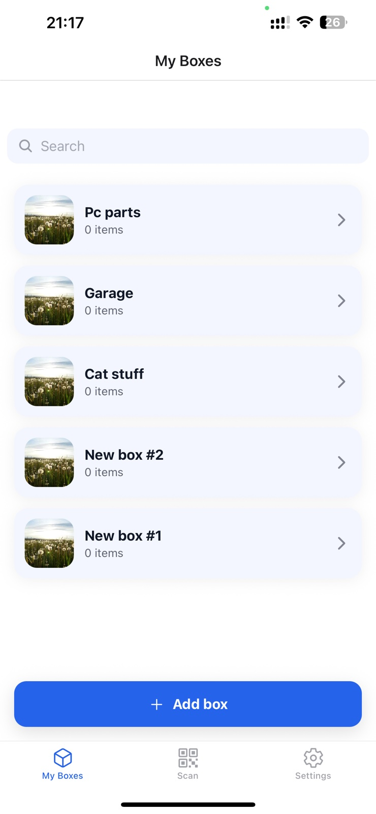
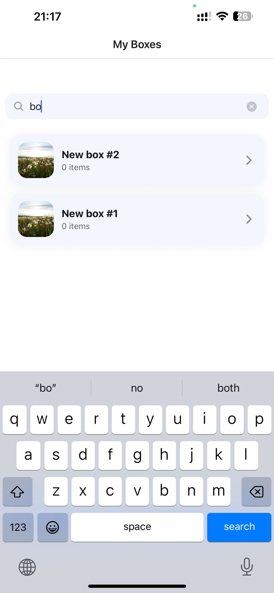
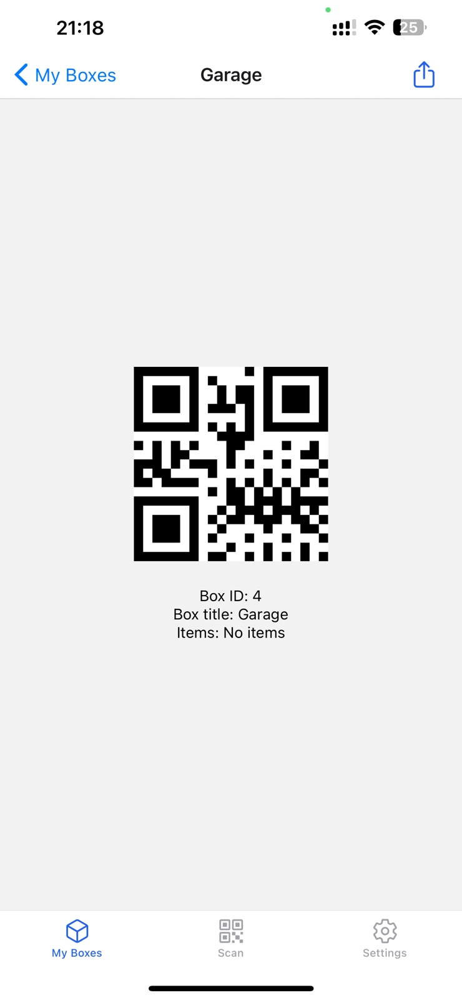
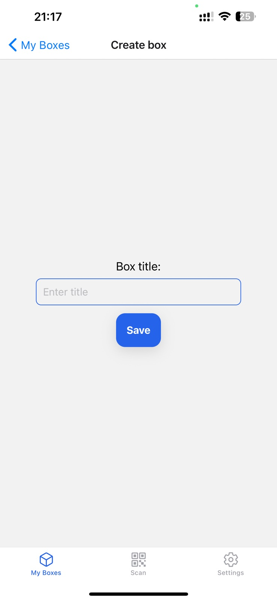
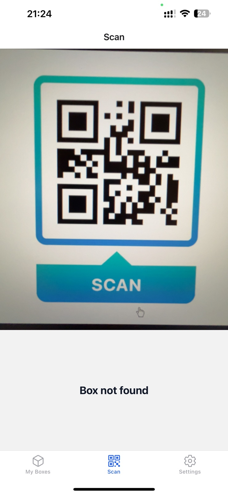
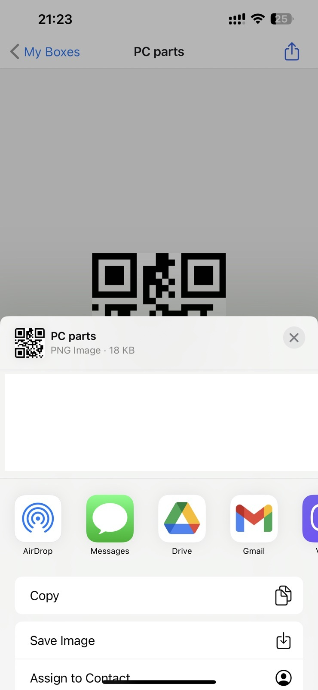

# Final Project — Boxes App

## 📌 Overview
This project is an improved version of the **Boxes App** developed during the course.  
The goal was not to build an app from scratch, but to **bring the existing product to a new level of quality, usability, and functionality**.

The app allows users to create boxes, view their details, generate and scan QR codes for quick access, and share box information.

---

## 🚀 Key Features
- **Box list**
  - Displays all created boxes.
  - Includes a search bar for filtering by title or items.
  - Optimized for orientation (1 or 2 columns depending on screen width).

- **Box details**
  - Displays box ID, title, and items.
  - Generates a QR code for each box.
  - Allows sharing the QR code via the system share dialog.
  - In "create mode", provides a text field for entering a new box title.

- **QR scanner**
  - Uses the camera to scan QR codes.
  - Verifies scanned codes against the backend.
  - Handles multiple states: *Scanning*, *Waiting*, *Found*, *Not found*.
  - Navigates directly to the Box Details screen when a box is found.

---

## 🛠️ Improvements Implemented
### Functional
- Added **QR code generation** for each box.
- Added **QR code sharing** using the system share dialog.
- Added **QR code scanning** with live camera integration.
- Added **Box creation screen** with a title input.

### UX/UI
- Used **SafeAreaView** for proper layout across devices.
- Dismiss keyboard on outside tap for better usability.
- Clear status messages for scanning states (*Scanning…*, *Not found*, etc.).

### Architecture
- App split into separate screens:
  - `BoxListScreen`
  - `BoxDetailsScreen`
  - `ScanScreen`
- Extracted **API logic** into `api.ts`.
- Navigation:
  - Tab navigation with `Scan` and `Boxes`.
  - Stack navigation for list, details, and create.

### Internationalization
- Added **translations** for sections and camera states using useContext.

---

## 📷 Screenshots

- Boxes list and search  
  
  

- Box details with QR code  
  

- Create box screen  
  

- QR scanner  
  

- Share dialog  
  
